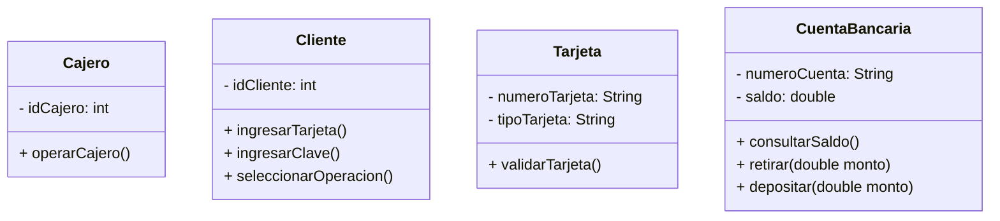
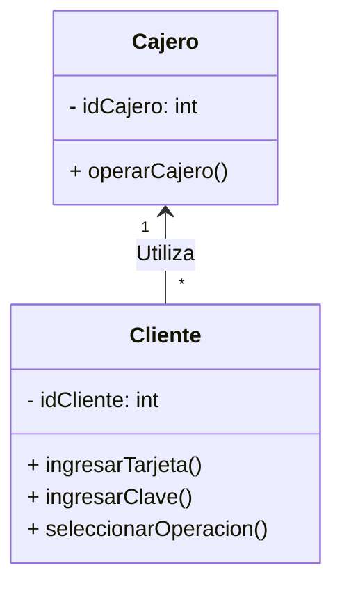
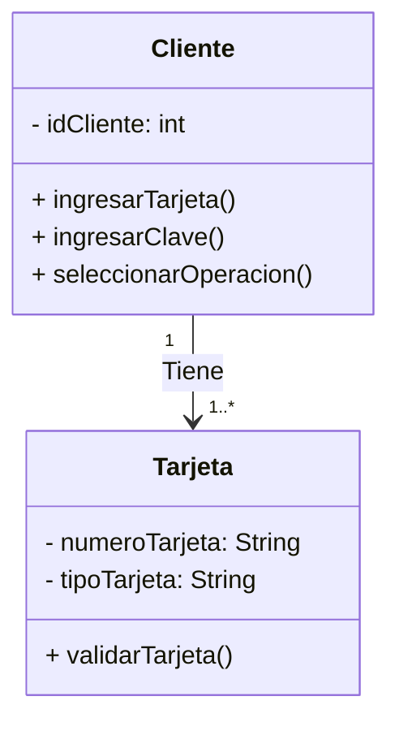
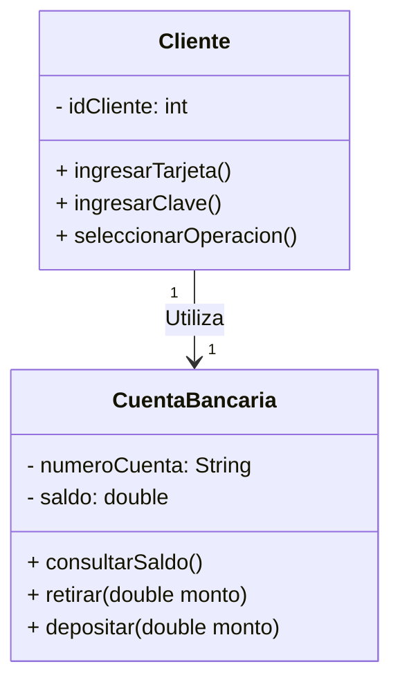
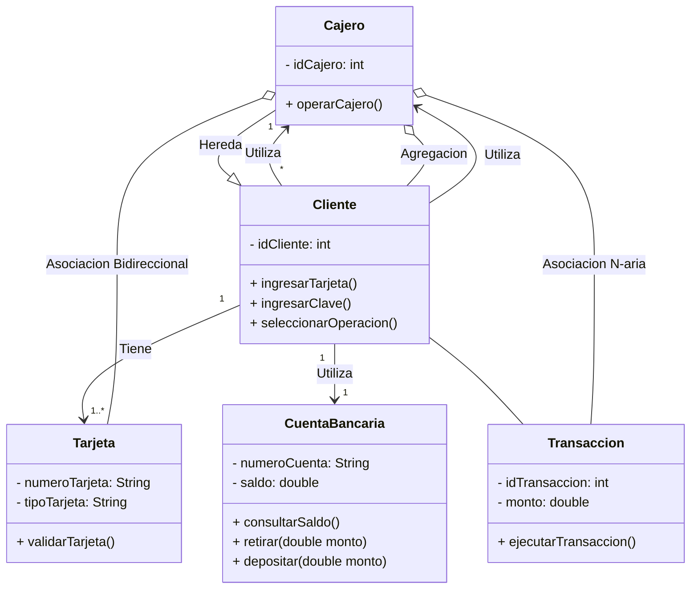

# Introducción a los Casos de Uso 
Los casos de uso son una técnica utilizada en el análisis y diseño de sistemas de software para capturar los requisitos funcionales del sistema desde la perspectiva del usuario. Proporcionan una descripción detallada de cómo interactúan los actores (usuarios o sistemas externos) con el sistema para lograr ciertos objetivos.

## ¿Qué es un Caso de Uso?

Un caso de uso describe una interacción entre un actor y el sistema para lograr un objetivo específico. Proporciona una narrativa detallada de cómo se utiliza el sistema en situaciones del mundo real. Cada caso de uso tiene un nombre único y describe una secuencia de pasos que el actor realiza para completar una tarea.

## Relaciones entre Casos de Uso

Los casos de uso pueden estar relacionados entre sí de varias formas, lo que ayuda a modelar y comprender cómo se interrelacionan las funcionalidades del sistema. Algunas de las relaciones comunes entre casos de uso incluyen:

### Inclusión

La relación de inclusión se utiliza cuando un caso de uso (caso de uso incluido) es parte de otro caso de uso (caso de uso base). Esto permite reutilizar funcionalidades comunes en múltiples casos de uso.

### Extensión

La relación de extensión se utiliza cuando un caso de uso (caso de uso extendido) puede ocurrir opcionalmente en otro caso de uso (caso de uso base). Esto permite modelar comportamientos alternativos o excepcionales dentro de un caso de uso.

### Generalización

La relación de generalización se utiliza cuando un caso de uso (caso de uso especializado) hereda comportamientos de otro caso de uso (caso de uso general). Esto permite agrupar casos de uso relacionados en una jerarquía de herencia.

### Dependencia

La relación de dependencia se utiliza cuando un caso de uso (caso de uso dependiente) requiere la funcionalidad proporcionada por otro caso de uso (caso de uso principal). Esto indica una dependencia entre los casos de uso y puede ocurrir durante la ejecución del sistema.

## Actividad 1

Estamos en proceso de desarrollo de un sistema de cajero automático para nuestra entidad bancaria.
Para garantizar la correcta implementación y comprensión de los requisitos del sistema, es crucial realizar una investigación exhaustiva sobre los casos de uso, su diagramación y las nomenclaturas utilizadas.

1. **Identificar Casos de Uso Relevantes:** Investigar y documentar todos los casos de uso relevantes para el sistema de cajero automático, incluyendo las interacciones entre los actores y el sistema.

2. **Diagramación de Casos de Uso:** Crear diagramas de casos de uso claros y comprensibles que representen las funcionalidades del sistema y las interacciones entre los actores y el sistema.

3. **Nomenclaturas Utilizadas:** Analizar y definir las nomenclaturas utilizadas en los casos de uso, asegurando consistencia y comprensión en toda la documentación.
4. Tenga en cuenta las clases que se presentan a continuación para hacer sus respectivos casos de uso y documentarlos.
5. **Codificación** Haga Fork al presente repositorio e inicie a programar su desarrollo basado en los casos de uso y en las clases propuestas.

# Taller Sistema de Cajero Automático

## Descripción del Problema

Se requiere desarrollar un sistema de cajero automático para una entidad bancaria. 
El sistema debe permitir a los clientes realizar diversas operaciones bancarias, como consultar saldo, retirar dinero, depositar fondos y realizar transferencias entre cuentas.

## Clases Principales

El sistema estará compuesto por las siguientes clases principales:

1. **Cajero:**
   - Esta clase representa el cajero automático en sí mismo.
   - Cada cajero tiene un identificador único y puede operar transacciones para múltiples clientes.

2. **Cliente:**
   - La clase Cliente representa a los usuarios del cajero automático.
   - Cada cliente tiene una identificación única y está asociado con una o varias cuentas bancarias.

3. **Tarjeta:**
   - La clase Tarjeta representa las tarjetas bancarias emitidas a los clientes.
   - Cada tarjeta tiene un número único y un tipo asociado (por ejemplo, débito o crédito).

4. **CuentaBancaria:**
   - La clase CuentaBancaria representa las cuentas asociadas a los clientes.
   - Cada cuenta tiene un número único y un saldo disponible.

5. **Transaccion:**
   - La clase Transaccion representa las transacciones realizadas por los clientes en el cajero automático.
   - Cada transacción tiene un identificador único, un monto y un tipo asociado (por ejemplo, retiro, depósito o transferencia).

## Funcionalidades

El sistema de cajero automático debe proporcionar las siguientes funcionalidades:

- Los clientes pueden ingresar su tarjeta y su clave secreta para acceder a su cuenta bancaria.
- Los clientes pueden consultar el saldo disponible en su cuenta.
- Los clientes pueden realizar retiros de efectivo de su cuenta.
- Los clientes pueden depositar fondos en su cuenta.
- Los clientes pueden transferir fondos entre cuentas propias o de terceros.

## Restricciones y Consideraciones

- El sistema debe garantizar la seguridad de las transacciones y proteger la información confidencial de los clientes.
- Se debe implementar un mecanismo de autenticación seguro para verificar la identidad de los clientes.
- Todas las transacciones deben registrarse y mantenerse de forma segura para fines de auditoría y seguimiento.
- El sistema debe ser fácil de usar y proporcionar retroalimentación clara al usuario durante todas las operaciones.

# Introducción a las Relaciones entre Clases en 

En el desarrollo de software, las relaciones entre clases son fundamentales para modelar la estructura y el comportamiento de un sistema. Estas relaciones permiten representar cómo las clases interactúan entre sí, intercambian información y colaboran para cumplir con los requisitos del sistema. 
Comprender y utilizar adecuadamente estas relaciones es esencial para diseñar sistemas robustos, flexibles y mantenibles.

## Tipos de Relaciones

Existen varios tipos de relaciones entre clases en el paradigma de programación orientada a objetos. 
Algunas de las relaciones más comunes incluyen:

### Asociación

La asociación representa una relación estructural entre dos clases, donde una clase está relacionada con la otra de alguna manera. 
Esta relación puede ser simple o compleja, y puede ser unidireccional o bidireccional.

### Agregación

La agregación es un tipo de asociación que representa una relación de "todo-parte" entre dos clases, donde una clase (todo) contiene a la otra clase (parte), pero las partes pueden existir independientemente del todo.

### Composición

La composición es una forma más fuerte de agregación donde las partes están estrechamente relacionadas con el todo y no pueden existir independientemente del todo. 
Si el todo se destruye, las partes también se destruyen.

### Herencia/Generalización

La herencia o generalización es una relación en la que una clase (subclase) hereda atributos y métodos de otra clase (superclase). 
Esto permite la reutilización de código y la creación de jerarquías de clases.

### Dependencia

La dependencia es una relación en la que una clase (cliente) utiliza los servicios de otra clase (proveedor) de alguna manera. 
Esto puede ocurrir a través de la creación de objetos, la llamada a métodos o la inclusión de objetos como parámetros en métodos.

### Asociación N-aria

La asociación N-aria representa una relación entre más de dos clases. 
Esto puede ocurrir cuando múltiples clases están involucradas en una misma interacción o funcionalidad.

## Clases

## Relaciones

### Relación de Agregación entre `Cajero` y `Cliente`

La relación de agregación entre `Cajero` y `Cliente` indica que un cajero puede ser utilizado por uno o varios clientes. Esta relación implica que un cajero puede tener múltiples clientes.

